# System Architecture & Topology (Speed-Optimized)

This document outlines the complete architecture of the Agoric Chat Bridge, focusing on a **speed-optimized, "Fire-and-Forget"** model. This design prioritizes rapid user response times by processing messages and logging them in parallel.

---

### 1. System Overview

The system is designed with three primary components, architected for parallel processing: **Core Backend**, **Dashboard API**, and a **Frontend Dashboard**.

#### A. Core Backend (Node.js + Fastify)
- **Function**: The heart of the system, responsible for handling all chat logic with a focus on speed.
- **Core Principle**: The main message processing flow is decoupled from the database logging flow.
    - **Real-time Flow**: Immediately forwards user messages to the AI Agent and delivers responses back as quickly as possible.
    - **Background Logging Flow**: Asynchronously writes conversation history to the database without blocking the real-time flow.
- **Components**:
    - `ChatIntegration`: Manages adapters and orchestrates the parallel flows.
    - `Adapters` (Telegram, Zalo, etc.): Interface directly with chat platforms.
    - `MastraClient`: Handles communication with the AI Agent.
    - `LoggerQueue / Async Handler`: A mechanism (like an in-memory queue or a simple async task) to handle database writes in the background.

#### B. Dashboard API (Extended from Fastify Server)
- **Function**: Provides data to the Frontend Dashboard, acknowledging that data may have a slight delay due to asynchronous logging.
- **Components**:
    - **REST API Endpoints**:
        - `GET /api/sessions`: Fetches a list of all sessions (with support for search, pagination).
        - `GET /api/sessions/:id`: Retrieves the full message history for a specific session.
        - `GET /api/stats`: Gathers real-time statistics (active sessions, messages per minute, etc.).
    - **Real-time Endpoint (WebSocket)**:
        - `WS /api/realtime`: A WebSocket channel to push real-time data (new messages, session status changes) to the dashboard without needing to refresh the page.

#### C. Frontend Dashboard (React)
- **Function**: A user interface for monitoring and managing chat sessions.
- **Components**:
    - `SessionList`: A side panel (left) that displays a list of all active and recent sessions.
    - `SessionView`: The main panel (right) that shows the conversation content of the selected session.
    - `Real-time Client`: A WebSocket client that listens for events to automatically update the UI when new data is available.

---

### 2. System Topology Diagram (Parallel Flow)

This diagram illustrates the decoupled flows for real-time processing and background logging.

```mermaid
graph TD
    subgraph "End User"
        User("👤 End User")
    end

    subgraph "Chat Platforms"
        ChatPlatform("🌐 Telegram, Zalo, etc.")
    end

    subgraph "Core Backend (Node.js)"
        direction LR
        Adapter("🔌 Adapter") -- Message --> ChatIntegration("🚀 ChatIntegration")
        
        subgraph "Real-time Processing Flow"
            ChatIntegration -- 1. Immediately forwards --> MastraClient("🤖 MastraClient")
            MastraClient -- 2. Receives AI response --> ChatIntegration
        end

        subgraph "Background Logging Flow"
            ChatIntegration -- 1a. Triggers async job --> LoggerQueue("🔄 Async Logging Queue")
            LoggerQueue -- 2a. Writes data --> Database("🗄️ Postgres/Redis")
        end
    end

    subgraph "Monitoring Dashboard"
        ReactApp("⚛️ React Dashboard") -- Fetches data from --> Database
    end
    
    subgraph "Dashboard API (Fastify)"
        RestAPI("📡 REST API")
        RealtimeAPI("⚡ WebSocket API")
    end

    %% Main Data Flow
    User -- Interacts with --> ChatPlatform
    ChatPlatform -- Webhook/Polling --> Adapter
    ChatIntegration -- 3. Sends immediate reply --> Adapter
    Adapter -- 4. Delivers message --> ChatPlatform

    %% Dashboard Data Flow
    Database -- Serves data to --> RestAPI
    ReactApp -- Initial Fetch --> RestAPI
    LoggerQueue -- After successful write --> RealtimeAPI -- Pushes Event --> ReactApp
```

---

### 3. Dashboard Workflow

1.  An **Admin** opens the **React Dashboard**.
2.  The dashboard calls the `GET /api/sessions` endpoint to fetch the current state of conversations from the **Database**.
3.  When a new message is processed by **ChatIntegration**, it is handled in two parallel flows:
    - **Flow 1 (Real-time)**: The message is sent to the AI, and the response is immediately sent back to the user.
    - **Flow 2 (Background)**: An asynchronous job is triggered to write the conversation to the database.
4.  Once the background job successfully writes to the database, it can trigger an event to the **Realtime API**.
5.  The **Realtime API** pushes this event via WebSocket to the dashboard, which then updates its UI.
    - **Note**: This means the dashboard will always have a slight delay compared to the actual conversation.

---

### 4. Architectural Trade-offs

This design makes a deliberate trade-off:

-   **Gained**:
    -   ✅ **Maximum Speed**: User response time is minimized as it is not blocked by database operations.
    -   ✅ **Better User Experience**: The application feels more responsive and interactive.

-   **Given Up**:
    -   ❌ **Data Consistency Guarantee**: There is a small risk of losing message history if the server crashes after a message is processed but before the background logging is complete.
    -   ❌ **Real-time Accuracy on Dashboard**: The data displayed on the dashboard will lag slightly behind the live conversation.

This architecture is ideal for applications where speed of interaction is the highest priority and the potential loss of occasional, non-critical log data is an acceptable risk.
